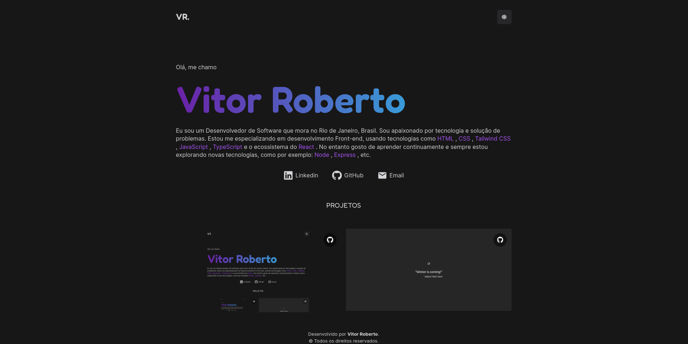

<h1 align="center">
  My Portfolio
</h1>

<h4 align="center">
  My portfolio website, which has some information about me and my personal projects.
</h4>

<p align="center">
  <a href="#technologies">Technologies</a>&nbsp;&nbsp;&nbsp;|&nbsp;&nbsp;&nbsp;
  <a href="#how-to-use">How To Use</a>
</p>



## Technologies

This project was developed with the following technologies:

- [TypeScript](https://www.typescriptlang.org/)
- [React](https://reactjs.org/)
- [Astro](https://astro.build/)
- [Tailwind CSS](https://tailwindcss.com/)
- [React-Icons](https://react-icons.github.io/react-icons/)

## How to use

To clone and run this application, you'll need [Git](https://git-scm.com), [Node.js v18.12.1](https://nodejs.org/en/) or higher + [npm v8.19.2](https://www.npmjs.com/) or higher installed on your computer. From your command line:

```bash
# Clone this repository
$ git clone https://github.com/vitoroberto/vitor-portfolio.git
# Go into the repository
$ cd vitor-portfolio
# Install dependencies
$ npm install
# Run the app
$ npm run dev
```
